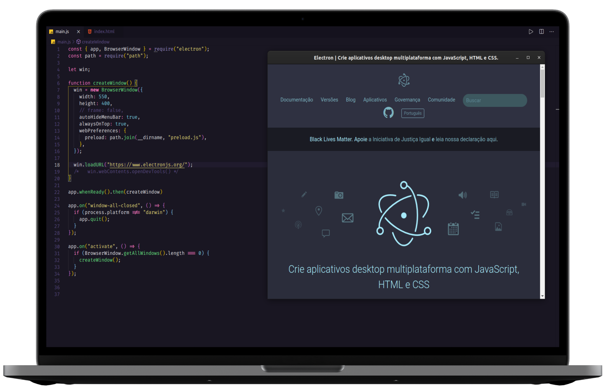

<h1 align="center">
  
</h1>

<p align="center">
  <a href="#-tecnologias">Tecnologias</a>&nbsp;&nbsp;&nbsp;|&nbsp;&nbsp;&nbsp;
  <a href="#-projeto">Projeto</a>&nbsp;&nbsp;&nbsp;
</p>

<p align="center">
 
</p>

<p align="center">
  
</p>

<br>

## 🎉 Install

```sh
npm install
```

## 🔥 Usage

```sh
npm start
```
Depois é só modificar a linha do main.js ```win.loadURL("http://localhost:5500/")``` adicionando a URL de sua preferência.

## 💻 Projeto

O Webview Simple, é um navegador criado para ser usado como visualizador de testes de app web, como server.


## 🚀 Tecnologias

Esse projeto foi desenvolvido com as seguintes tecnologias:

- ElectronJs **(Framework)**
- JavaScript

---

Feito com ♥ by Lucas Almeida :wave:

